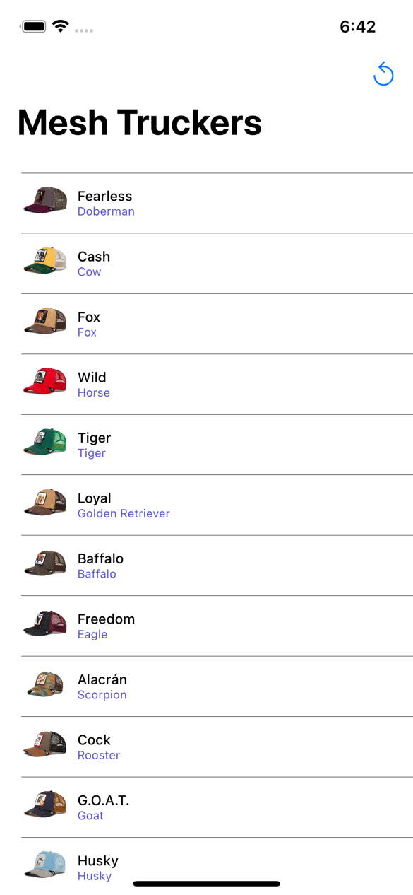

# SwiftUI-List
Example for a List in SwiftUI.

Features:

* MVVM design pattern
* iOS Combine for Networking
* Async/Await mechanism when fetching data
* AsyncImage for downling images (Note that iOS 15 and above is required here)
* Timeout for fetching
* Cache for images (NSCache)
* Placeholders
* Refresh Button
* Navigation link for each cell (opens a details view)
* ProgressView for main list + for each image

[Pre-Requisities: iOS 15 Xcode 13]

## License
MIT

## Sample

### Artwork

Images shown in list are from Shopify. See images urls im my gist here:

https://gist.githubusercontent.com/raw/3b15d0220b17236514acf8803835ded6/hat_store.json

The default avatar is from Stockio

https://www.stockio.com/free-icon/baseball-cap
